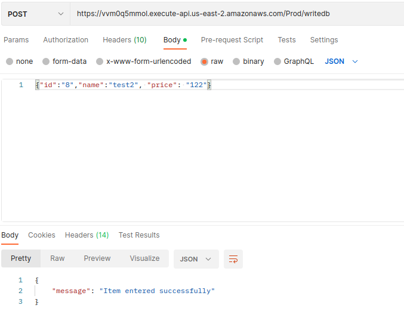
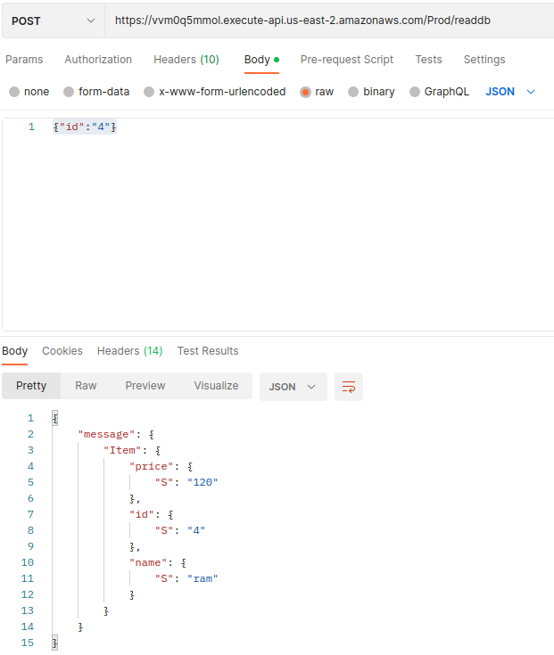
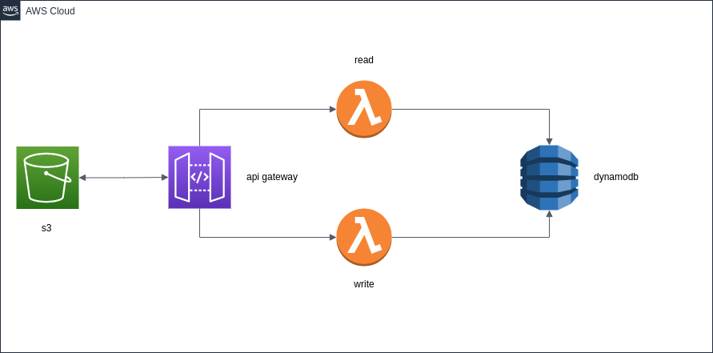

## Terraform Pipeline

This main propuse of this repo is to function as an example of how github actions can be implemented to do gitops
by using terraform to create an infrastructure as code that will be created on aws, to accomplish that this workflow does the following:

- run terraform plan using terraform cloud to check if code is ready to be merge

- show results on the pull request

- after pull request is accepted, runs terraform apply to create the infrastructure on aws and pushes to main

## Important

When working with a repository it is important to remember to keep our local repository up to date, so it is
advise to run a git pull command in our local branches after pushing code to this repository

## Usage 

To add new features to the infrastructure we must work first in the development branch,
after the feature is complete we can then push our changes by using the following commands:

first we must check if we are in the feature branch for that we use

`git branch`

then we must add the changes

`git add .`

after that we need to commit our changes

`git commit -m "example commit"`

and finally

`git push`

## Use serverless api

this api has two endpoints, one for posting data to dynamodb and one for getting an item based on the id, both can be access with postman

the first endpoint is: https://15elz8upu6.execute-api.us-east-2.amazonaws.com/Prod/writedb

to make a sample request the following can be use:

`{"id":"8","name":"test2", "price": "122"}`

the second endpoint is: https://15elz8upu6.execute-api.us-east-2.amazonaws.com/Prod/readdb

to make a sample request the following can be use:

`{"id":"4"}`

## Diagram

 
